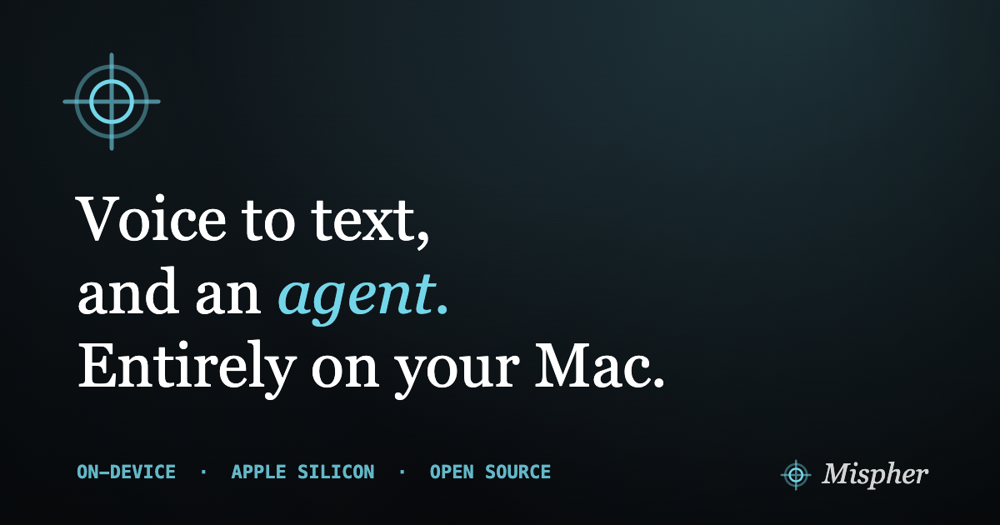

<p align="center">
  <a href="https://dsaad68.github.io/mispher/">
    
  </a>
</p>

<p align="center">
  
  
  
  
</p>

<p align="center">
  <a href="https://dsaad68.github.io/mispher/"><b>Website</b></a> &middot;
  <a href="https://github.com/dsaad68/mispher/releases/latest"><b>Download</b></a> &middot;
  <a href="CHANGELOG.md"><b>Changelog</b></a>
</p>

---

**Mispher** turns speech into clean text anywhere on macOS, then goes further - dictation cleanup,
rewrite-in-place, translation, and an on-device agent that plans, uses tools, and answers. No cloud,
no accounts. **Nothing leaves your Mac.**

## Install

**Homebrew** (recommended) - a signed, notarized build, no Xcode required:

```sh
brew install --cask dsaad68/tap/mispher
```

**Direct download** - grab the latest signed `Mispher.dmg` from the
[releases page](https://github.com/dsaad68/mispher/releases/latest) (or the
[website](https://dsaad68.github.io/mispher/)), open it, and drag **Mispher** to Applications.

On first launch Mispher walks you through downloading its on-device models. They live in your local
Hugging Face cache and run entirely on your Mac.

## What it does

Summon the radial **dial** with a hotkey and flick toward a mode - or press an arrow key. Every slice
is remappable.

| Mode | What it does |
|---|---|
| **Transcribe** | Fast, accurate speech-to-text dropped straight into any focused field. Parakeet for English, Nemotron for ~40 languages. |
| **Translate** | Speak in one language, insert another - auto-translate everything you dictate, or a one-off into a target language. |
| **Rewrite** | Speak an instruction and Mispher rewrites the selected text in place. |
| **Ask** | Hold, speak a question, and an on-device agent plans, uses tools, and streams the answer back. |

Talk however suits you: **hold** to push-to-talk, **tap** to toggle, or go fully **hands-free** with
recording that ends on a silence timeout. Three overlay styles keep it readable but unobtrusive, and
voice modes and Ask can each use their own.

## The agent

**Ask** runs an on-device [DeepAgent](https://github.com/dsaad68/deepagents-swift) - it plans, calls
tools, and streams back an answer. Out of the box it can:

- 👁️ **See your screen** - take a screenshot and reason over what's on it
- 📝 **Use Apple Notes** - list, read, create, and update notes
- 📁 **Work with files** - read and edit files in a working folder
- 📋 **Touch the clipboard** - read and write the system clipboard
- 🔌 **Connect MCP servers** - bring your own Model Context Protocol tools

You decide which tools the agent may use and how each call is approved - **approve**, **ask**, or
**deny**, per tool or per server.

## Private by design

> Speech recognition, cleanup, translation, and the agent all run locally in Apple's MLX framework on
> Apple Silicon. There is no server to send audio to, no account to create, and nothing to opt out of
> - because there's nowhere for your words to go.

Mispher uses [LFM2.5](https://huggingface.co/LiquidAI) models (an 8B-A1B planner and a vision model)
for the agent and dedicated speech models for transcription, all via
[MLX](https://github.com/ml-explore/mlx-swift).

## Requirements

- macOS 26+ (Tahoe)
- Apple Silicon (arm64)

## Build from source

Open the app project in Xcode and build the `Mispher` scheme:

```sh
open app/Mispher/Mispher.xcodeproj
```

Xcode resolves the [DeepAgents-swift](https://github.com/dsaad68/deepagents-swift) Swift package on
first build (a one-time network fetch). Xcode 26+ is required - its build system emits MLX's Metal
shader library, which `swift build` does not co-locate.

## License

MIT - see [`LICENSE`](LICENSE). Copyright (c) Daniel Saad.

Mispher depends on the [DeepAgents-swift](https://github.com/dsaad68/deepagents-swift) framework
(MIT), maintained separately and resolved as a Swift package.
