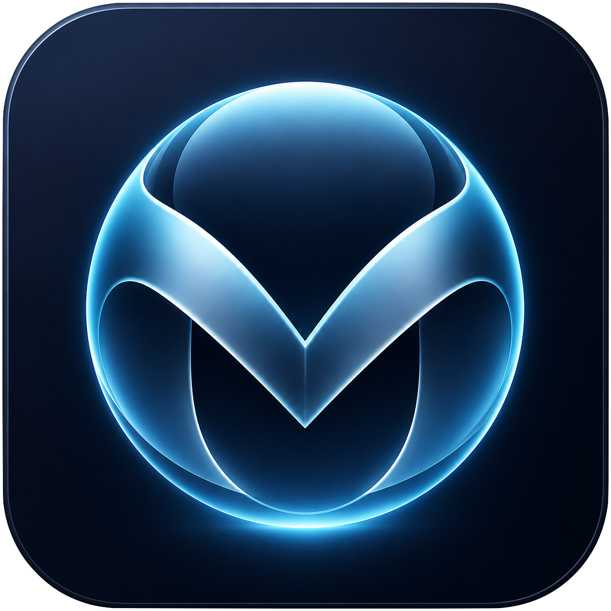

<p align="center">
  
</p>

<h1 align="center">Mispher</h1>

<p align="center">
  
  
  
  
</p>

<p align="center">
  An on-device AI assistant for macOS: a menu-bar / HUD app that runs
  <a href="https://huggingface.co/LiquidAI">LFM2.5</a> models locally on Apple Silicon via MLX.
  Built on <a href="https://github.com/dsaad68/deepagents-swift">DeepAgents-swift</a>.
</p>

---

## Requirements

- macOS 26+ (Tahoe), Apple Silicon (arm64)
- Xcode 26+ to build (Xcode's build system emits MLX's Metal shader library, which `swift build`
  does not co-locate)

## Build

Open the app project in Xcode and build the `Mispher` scheme:

```sh
open app/Mispher/Mispher.xcodeproj
```

The bundled `./DeepAgents` framework resolves the project's local package reference, so the repo is
clone-and-build with no external checkout. Models come from your local Hugging Face cache; pre-fetch
a planner first, e.g.:

```sh
hf download LiquidAI/LFM2.5-1.2B-Instruct-MLX-bf16
```

## License

MIT -- see [`LICENSE`](LICENSE). Copyright (c) Daniel Saad.

The bundled DeepAgents-swift framework (`./DeepAgents`) is maintained separately at
https://github.com/dsaad68/deepagents-swift (MIT) and vendored here only so the app builds without
an external checkout.
